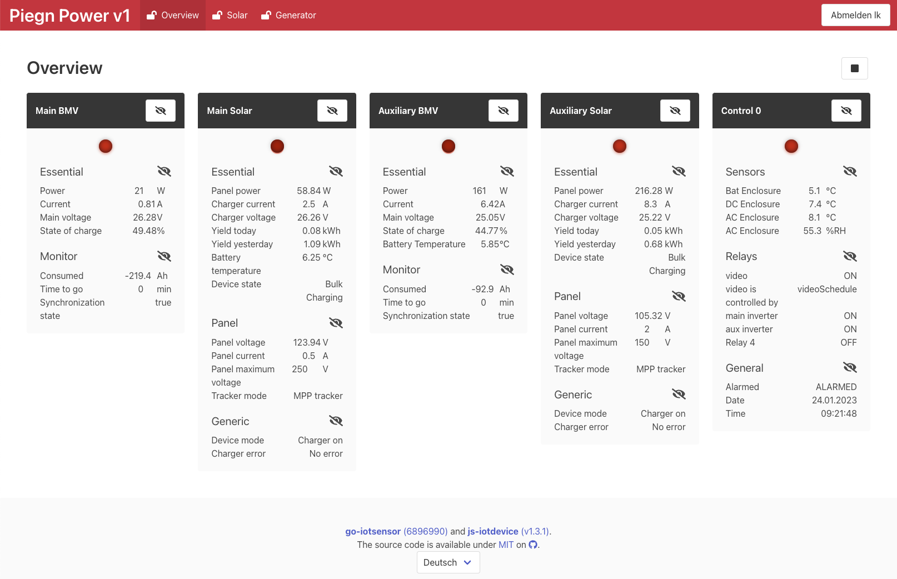

# js-iotdevice
[](https://github.com/koestler/js-iotdevice/actions/workflows/docker-image.yml)

This is the fronted for [github.com/koestler/go-iotsensor](https://github.com/koestler/go-iotsensor).
See it's [README](https://github.com/koestler/go-iotsensor#readme) for more details.



This is a simple react project created by [Create react app](https://create-react-app.dev/)
with only client side rendering.

## Creating a production build
The production build adds a static build of the html, js and css files to `/usr/share/nginx/html`
of a nginx docker image.
### `docker build -f docker/Dockerfile -t koestler/js-iotdevice .`

When uses together with [go-iotsensor](https://github.com/koestler/go-iotsensor) the nginx server is not
used and the files are served directly by the backend.

## Development
In the backend config, configure the http-server as follows:
```yaml
HttpServer:
  FrontendProxy: "http://127.0.0.1:3000/"
```

### `npm install`
Installs the dependencies.

### `npm run start`
Starts a local node instance running the app in development mode (auto recompiling, hot code reload).

### `npm run extract`
Extract newly added translation into the po files.

### `npm run compile`
Compilies to po (translation) files into javascript code. Is run automatically
whenever `npm run build` is run.

### `npm run build`
Builds the app for production to the `build` folder.